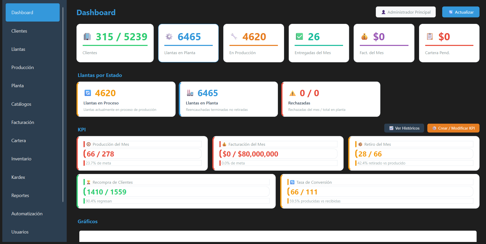
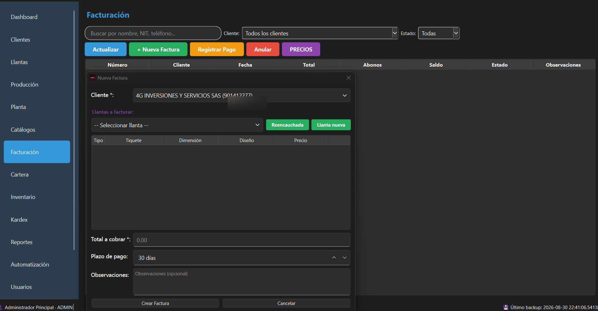
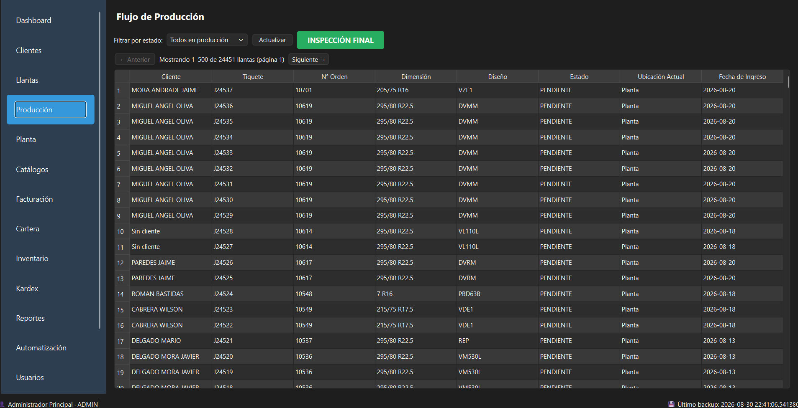
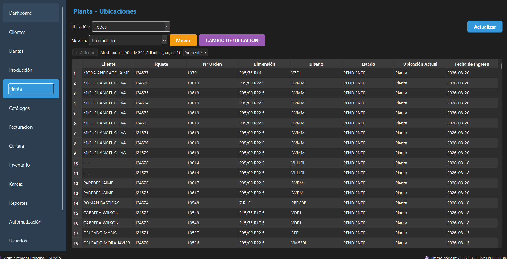
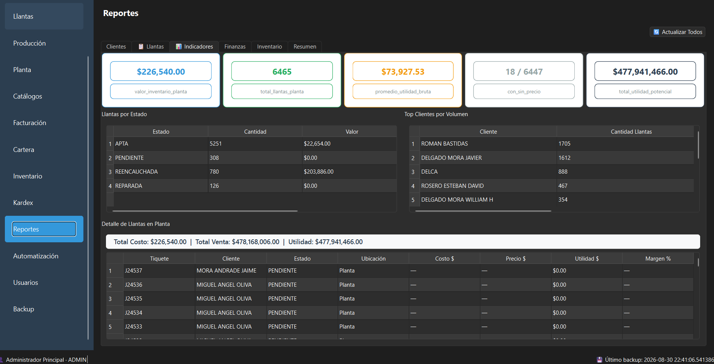

# DELCA ERP

[](https://www.python.org/)
[](https://doc.qt.io/qtforpython-6/)
[](https://www.sqlalchemy.org/)
[](LICENSE)
[](https://github.com/munozandresfb-hub/DELCA-ERP/actions/workflows/ci.yml)

Sistema de planificación de recursos empresariales (ERP) para el reencauche de llantas.
Construido con Python + PySide6 + SQLAlchemy + SQLite.

## Capturas







## Stack Tecnológico

| Componente | Tecnología |
|---|---|
| Frontend | PySide6 6.11 (Qt for Python) |
| ORM | SQLAlchemy 2.0 (Mapped + legacy hybrid) |
| DB | SQLite 3 (WAL mode, foreign_keys ON) |
| Auth | bcrypt + SHA-256 |
| Python | 3.13+ |

## Requisitos

- Python 3.13 o superior
- PowerShell (Windows) o bash (Linux/macOS)

## Instalación

```bash
# 1. Clonar el repositorio
git clone https://github.com/munozandresfb-hub/DELCA-ERP.git
cd DELCA-ERP

# 2. Crear entorno virtual
python -m venv .venv

# 3. Activar entorno
# Windows:
.venv\Scripts\activate
# Linux/macOS:
# source .venv/bin/activate

# 4. Instalar dependencias
pip install -r requirements.txt
```

## Ejecución

```bash
python main.py
```

La primera ejecución crea las tablas en `delca.db` y el usuario administrador por defecto.

### Credenciales por defecto

| Usuario | Contraseña |
|---|---|
| `admin` | `admin123` |

## Arquitectura

### Patrón MVVM (Model-View-ViewModel)

```
src/
├── core/                # Núcleo de la aplicación
│   ├── views/           # Dashboard, MainWindow
│   └── services/        # Dashboard KPIs, métricas
├── database/            # Capa de datos
│   ├── engine.py        # Engine SQLAlchemy + WAL + sesiones
│   └── base.py          # Base declarativa
├── modules/             # Módulos funcionales
│   ├── clientes/        # Gestión de clientes
│   ├── llantas/         # Trazabilidad de llantas
│   ├── finanzas/        # Facturación, cartera, pagos
│   ├── inventario/      # Productos, kardex, movimientos
│   ├── reportes/        # Reportes cruzados
│   ├── automatizacion/  # Reglas + alertas automáticas
│   ├── auditoria/       # Log de cambios
│   └── usuarios/        # Login, roles, bootstrap
└── ui/                  # Componentes UI reutilizables
```

### Flujo de datos

```
Vista (PySide6 Widget) → ViewModel → Service → Repository → ORM (SQLAlchemy) → SQLite
```

## Módulos

### Dashboard
- 6 tarjetas KPI (Clientes, Llantas, Producción, Entregas, Facturación, Cartera)
- Badges de llantas por estado
- Feed de actividad reciente
- Botón de actualización manual

### Clientes
- CRUD completo (crear, editar, eliminar)
- Búsqueda por nombre, NIT, teléfono, email
- Validación de campos obligatorios
- Saldo pendiente automático

### Llantas
- Registro de llantas con tiquete, marca, dimensión, diseño
- Trazabilidad por estados: PENDIENTE → APTA → REENCAUCHADA/REPARADA (con REPROCESO en inspección final)
- Historial de cambios de estado y ubicaciones
- Filtro por estado y búsqueda

### Producción
- Vista del pipeline de producción
- Llantas activas en flujo (PENDIENTE → APTA → REENCAUCHADA / REPROCESO)
- Botón **INSPECCIÓN FINAL**: aplicación rápida de veredicto por tiquete
- Filtro por estado

### Planta
- Mapa de ubicaciones en planta
- Botón **CAMBIO DE UBICACIÓN**: movimiento validado por combinación estado↔ubicación
- Filtro por ubicación

### Facturación
- Creación de facturas con numeración automática (FAC-0001)
- Registro de pagos (EFECTIVO, TRANSFERENCIA, TARJETA, CHEQUE, OTRO)
- Anulación de facturas
- Filtro por estado: Todas / Pendiente / Pagada / Anulada
- Actualización automática del saldo del cliente

### Cartera
- Saldos pendientes por cliente
- Reporte de antigüedad de saldos (0-30, 31-60, 61-90, 90+ días)
- Badges de resumen con códigos de color
- Coloración de filas por rango de antigüedad

### Inventario
- CRUD de productos con SKU único
- Categorías: MATERIA_PRIMA, INSUMOS, HERRAMIENTAS, REPUESTOS, EMPAQUES, OTROS
- Movimientos: ENTRADA, SALIDA, MERMA, AJUSTE
- Stock inicial automático con asiento kardex
- Búsqueda por nombre, SKU, categoría

### Kardex
- Historial completo de movimientos de inventario
- Filtro por producto y tipo de movimiento
- Resumen: total productos, unidades, valor inventario, stock bajo
- Coloración: verde (entrada), rojo (salida/merma), naranja (ajuste)

### Reportes
- **Clientes**: Por ciudad, activos vs inactivos, mayor saldo
- **Llantas**: Por estado, por cliente, tiempo promedio de producción
- **Finanzas**: Facturación por mes, pagos por método, facturas por estado
- **Inventario**: Por categoría, movimientos por tipo, stock bajo
- **Resumen general**: Dashboard de totales

### Automatización
- 4 reglas preconfiguradas: Stock Bajo, Cartera Vencida 30+, Cartera Vencida 60+, Llantas Listas
- Evaluación manual o automática (cada 5 minutos)
- Alertas con niveles (INFO, WARNING, CRITICAL)
- Deduplicación por entidad
- Marcar como leída / todas leídas
- Limpieza automática de alertas antiguas

## Base de Datos

13 tablas gestionadas por SQLAlchemy:

| Tabla | Propósito |
|---|---|
| `roles` | Roles de usuario |
| `usuarios` | Usuarios del sistema |
| `cliente` | Clientes |
| `llantas` | Llantas registradas |
| `estados_llanta` | Historial de estados por llanta |
| `ubicaciones_llanta` | Historial de ubicaciones por llanta |
| `facturas` | Facturas emitidas |
| `pagos` | Pagos registrados |
| `productos` | Catálogo de productos |
| `movimientos_inventario` | Movimientos kardex |
| `auditoria` | Log de cambios |
| `reglas_automatizacion` | Reglas de automatización |
| `alertas` | Alertas generadas |

WAL mode activado para mejor rendimiento en concurrentes.
`expire_on_commit=False` para mantener objetos utilizables post-commit.

## Build de Producción

```bash
# Generar EXE con PyInstaller
pyinstaller --onefile --windowed --name "DELCA ERP" main.py
```

El ejecutable se generará en `dist/DELCA ERP.exe`.

## Variables de Entorno

Ninguna requerida. La DB se crea automáticamente en el directorio del proyecto.
